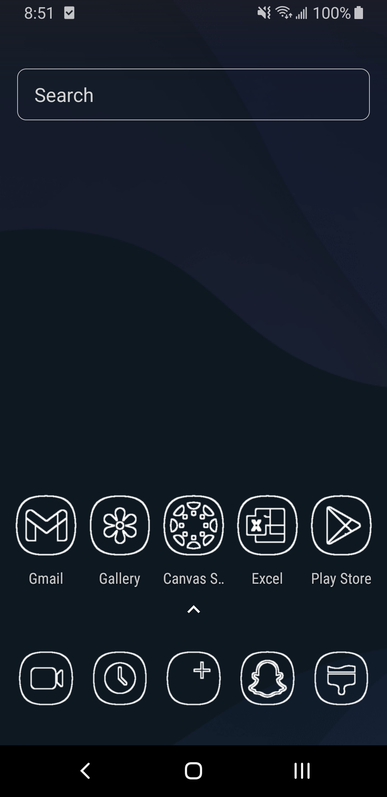
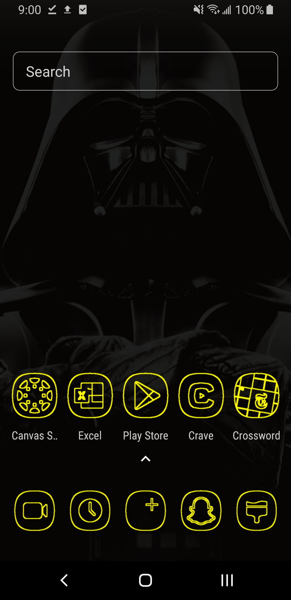
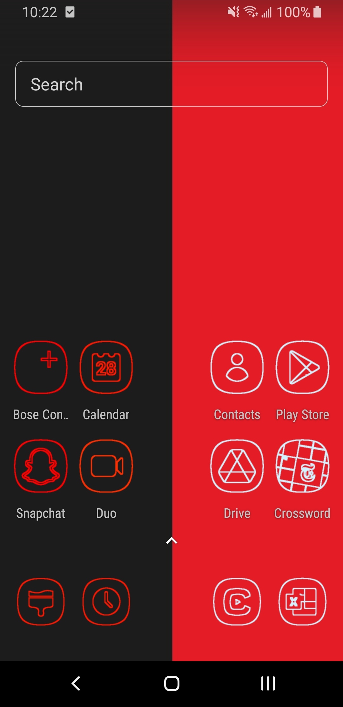
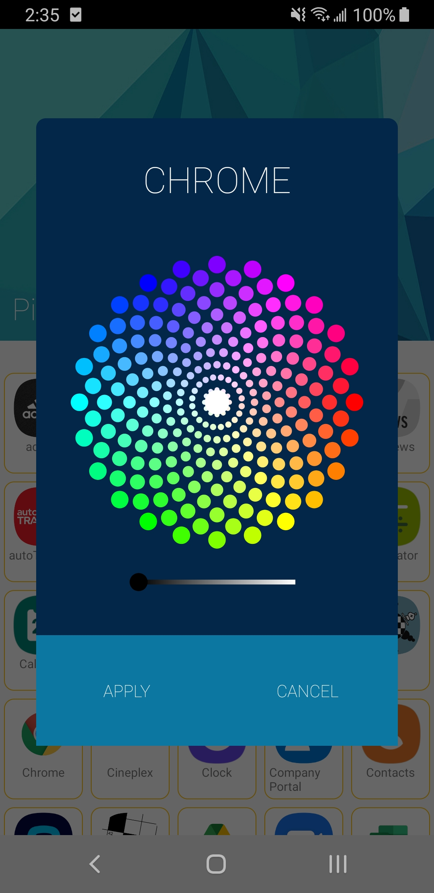
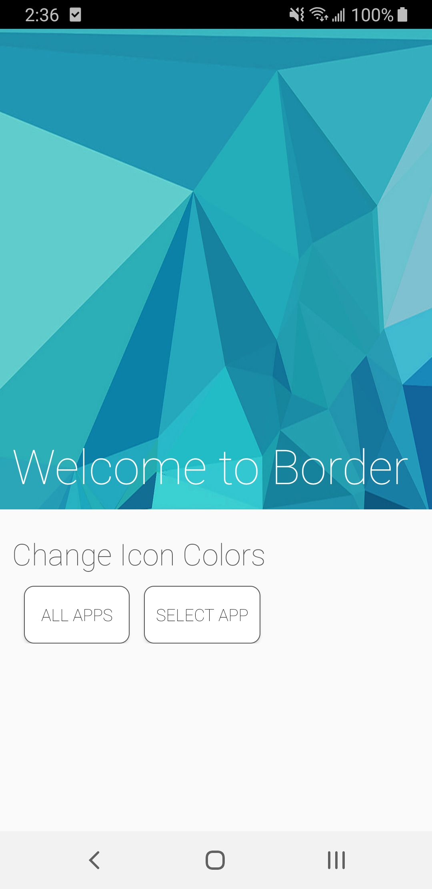

# Border Launcher
Border Launcher was built off the AOSP launcher and lets the user create custom icons at runtime.
## Background
- The app uses uses an algorithm built using opencv to customize icons
- Users can customize each icon to be any color in the RGB spectrum
- Once the users have chosen the color, the app processes the icon of the app they have chosen to create a new icon image instantly
- This is done with no storage overhead and minimal one time processing relative to the stock android launcher

## screenshots
Users can choose to change some, all or individual icons to be the color they want

Icons after processing             |  Coloring all icons         |  Individual coloring
:-------------------------:|:-------------------------:|:-------------------------:
       |         |  |

Color picker               |  Menu
:-------------------------:|:-------------------------:
)      |  
